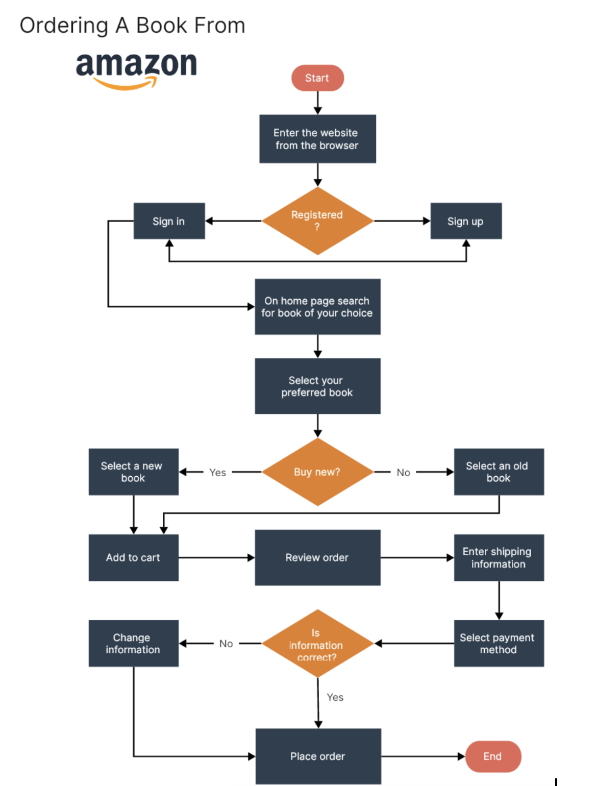

# Planning Docs Template

## How to use

This template has examples for each section already baked in. What we would like you to do, is complete each section **before** you do any coding. Make a great plan and your process will be smoother.

## User Stories

Write your own user stories to get a better understanding of a user's experience on your website.

* As a user, I want to be able to create new notes so that I can jot down my ideas or important information.
* As a user, I want to view my existing notes so that I can see what I've written previously.
* As a user, I want to edit the content of my notes so that I can make changes or corrections as needed.
* As a user, I want to delete notes that are no longer relevant or needed and be redirected to the notes index page after a successful deletion.
* As a user, I want a navigation bar with links to the form page, home page, and an about us page for easy navigation.
* As a user, I want to categorize my notes so that I can organize them based on different topics or subjects.
* As a user, I want to search for notes by title or content so that I can quickly find the information I need. I want the search to update as I type.
* As a user I want to be able to see information about the developers of the app on an about us page

## User Flow Chart

## Wire Frames

Include a link to your wire frames here. If you choose to sketch them by hand, takes pictures and put them here.

[Wire Frames Example](https://www.figma.com/file/o4Ci5ezn6OmP0yW7TaAAvS/Note-Taking-App-Wireframes?type=whiteboard&node-id=0%3A1&t=mRFyOdRJO0xsg5dB-1)

[Intro to Wire framing video](https://www.youtube.com/watch?v=qpH7-KFWZRI)

## Frontend Routes, React Components & Views

> Note: This section will outline the routes and their corresponding React components. Meaning just the components that are a whole page/view. You can have more react components nested inside them if needed!

`/notes - <NotesList> (index/home page)`
`/notes/:id - <Note> (show)`
`/notes/new - <NewNoteForm> (new)`
`/notes/:id/edit - <EditNoteForm> (edit)`
`/about - <AboutUs> (information about the team)`

## API Routes

> For this section you'll list what API routes you'll be using. You'll need to make some attempts to fetch data on postman before you fill out this section

`BASE_URL https://my-json-server.typicode.com/RazEfron/demo`

`POST /notes (create)`

`GET /notes (read)`

`GET /notes/:id (read)`

`PUT/PATCH /notes/:id (update)`

`DELETE /notes/:id (delete)`

## Technologies

> List the technologies you're using and the API you chose

## Project Management

Include a link to your trello board or other project management tools you're using. Everything you have on this doc should be linked in the project management tool so it serves as your command center that has everything you need in it

* [Project Workflow or Turning User stories to Cards](https://github.com/10-6-pursuit/unit-front-end-web-development/tree/main/project-workflow)

* [App planning](https://github.com/10-6-pursuit/unit-front-end-web-development/tree/main/app-planning)

## More Links and Resources

[Basic of Web Design Deck](https://docs.google.com/presentation/d/1I_vOls7iGs2pK4-i4bICT2uUqI4ykJToh0oXSQFBcto/edit?usp=sharing)